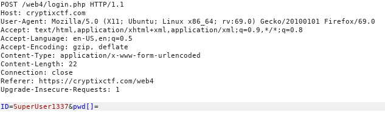
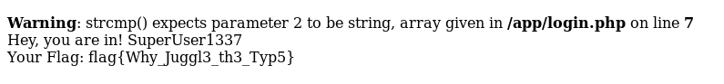

## Your ID please ([Link](https://cryptixctf.com/web4))

- Mới vào thì đề cho ta cái *source* như thế này

  ```php
  include_once 'flag.php';
  
  if($_SERVER["REQUEST_METHOD"] == "POST"){
      if(isset($_POST["ID"])&&isset($_POST["pwd"])){
          if(strcmp($secretpassphrase, $_POST["pwd"]) == 0){
              echo "Hey, you are in!  " . $_POST["ID"]  . "<br>";
              if($_POST["ID"] == "SuperUser1337"){
                  echo "Your Flag: " . $flag;
              }
          }else{
              echo "<script type='text/javascript'>alert('Unable to Login');</script>";
          }
      }
  }
  ```

- Đề yêu cầu ta nhập 2 tham số là *ID* và *pwd*

- Đọc *source* thì ta có thể thấy rõ là *ID* phải là *SuperUser1337* thì mới hiện flag. Vậy là chỉ còn vấn đề ở *pwn*

- Hàm *strcmp* dùng để so sánh 2 chuỗi với nhau theo cú pháp: `strcmp( $str1, $str2)`

  - Với *$str1* và *$str2* là 2 chuỗi cần so sánh
  - Trả về 0 nếu 2 chuỗi giống nhau
  - Trả về `<0` nếu *$str1*  ngắn hơn *$str2*
  - Trả về `>0` nếu *$str1*  dài hơn *$str2*

- Biến *$secretpassphrase* là biến được giấu kín trong đề. Ta phải nhập *pwn* sao cho giống biến *$secretpassphrase* thì mới có thể lấy flag

- Tuy nhiên hàm *strcmp* lại gặp lỗi là nếu so sánh 1 chuỗi với 1 array thì nó sẽ báo *WARNING*, tuy nhiên kết quả vẫn trả về 0, vậy ta có thể bypass qua *strcmp* dễ dàng

- Để biết kỹ hơn và nhiều kiểu bypass liên quan thì đọc link này, mình thấy nó rất hay cho những dạng như thế này: [Link](https://hydrasky.com/network-security/php-string-comparison-vulnerabilities/)

- Nói lý thuyết vậy được rồi, giờ đến thực hành. Ta dùng `Burp suite` để thay đối *type* của *pwn* từ *string* thành *array*




